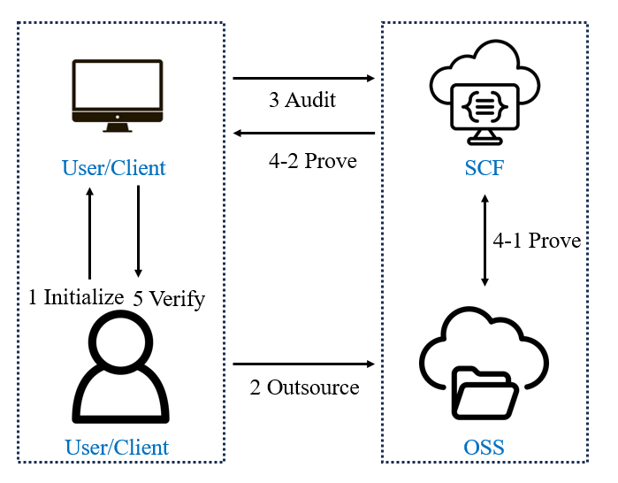

# 基于无服务器计算的云存储审计系统 II

云存储作为现代基础设施极大简化了应用系统的开发，但也带来了数据安全挑战。现有云存储审计方案虽在理论上取得进展，但实际应用中仍面临成本高、效率低的问题。

本项目提出基于无服务器云函数（SCF）的云存储审计系统，通过以下三个方面提升实用性：
1. **并行数据传输**：基于多TCP连接的并行数据块传输，提升运行效率
2. **成本优化**：最大化利用云资源的同时降低SCF执行时间
3. **自动化部署**：简化云服务部署流程，提升易用性

实验表明，本系统在大规模数据审计任务中表现优异：审计时间降至现有方案的10%，审计成本仅为原来的5%。

SCF 作为对象存储的接口，涉及三个关键组件：用户、存储服务和计算服务。审计流程如下：

<div align="center">
    
</div>

---

## 项目结构

```
src/main/java/com/fchen_group/TPDSInScf/
├── Core/                          # 审计核心算法
│   ├── IntegrityAuditing.java     # 5步协议：KeyGen→OutSource→Audit→Prove→Verify
│   ├── ChallengeData.java         # 挑战数据结构
│   ├── ProofData.java             # 证明数据结构
│   └── PseudoRandom.java          # 伪随机数
│
├── Utils/                         # 云平台抽象层
│   ├── CloudAPI.java              # 腾讯云COS API
│   ├── AliCloudAPI.java           # 阿里云OSS API
│   ├── TenYunControl.java         # 腾讯云SCF控制（部署/调用/配置）
│   ├── AliYunControl.java         # 阿里云FC控制
│   ├── AwsControl.java            # AWS Lambda控制
│   ├── AzureControl.java          # Azure Functions控制
│   ├── TenRequestClass.java       # 请求/响应数据模型
│   ├── ResponseClass.java         # 响应封装
│   ├── XmlConfigParser.java       # XML测试配置解析器 [新增]
│   └── ReedSolomon/               # RS纠删码 GF(2⁸)
│
├── Run/                           # 入口与云函数处理器
│   ├── Benchmark.java             # ★ 自动化测试主框架 [新增]
│   ├── TenHandle.java             # 腾讯云SCF处理器
│   ├── AliHandle.java             # 阿里云FC处理器
│   ├── AwsHandle.java             # AWS Lambda处理器
│   ├── AzureHandle.java           # Azure Functions处理器
│   ├── Client.java                # 手动测试入口
│   ├── AliClient.java
│   ├── AwsClient.java
│   └── AzureClient.java
│
├── Properties                     # 当前激活的平台配置
├── Properties-tencent             # 腾讯云配置
├── Properties-ali                 # 阿里云配置
├── Properties-aws                 # AWS配置
├── Properties-azure               # Azure配置
└── test-config.xml                # XML测试参数配置 [新增]
```

## 审计协议（5步）

```
KeyGen → OutSource → [上传到云端] → Audit(SCF调用) → Prove → Verify
```

| 步骤 | 执行位置 | 说明 |
|------|---------|------|
| KeyGen | 本地 | 生成加密密钥和认证密钥 |
| OutSource | 本地 | 文件编码为k=223数据块+m=32校验块，生成认证标签 |
| Upload | 本地 | 上传sourceFile.txt和parities.txt到云存储 |
| Audit | 本地 | 生成长度l=460的随机挑战 |
| Prove | SCF内 | 从云端下载挑战块，计算数据和校验证明 |
| Verify | 本地 | 验证证明正确性，判断数据完整性 |

参数：n=255, k=223, GF(2⁸), 挑战长度l=460，测试文件~7MB。

## 构建

本项目使用 **Java 1.8** + **Maven** 开发，支持四个云平台（腾讯云/阿里云/AWS/Azure）。

配置 **Properties** 文件以访问对象存储和SCF服务，并指定中间审计文件的存放位置。

```bash
# 使用 development-Azure profile 一次性构建包含全部平台SDK的JAR
mvn package -Pdevelopment-Azure -DskipTests
```

构建产物：`target/TPDSInSCF-1.0-SNAPSHOT_Benchmark-jar-with-dependencies.jar`

## 手动运行（单次测试）

打包后将 **Properties** 文件放在JAR同目录，运行：

```bash
java -cp TPDSInSCF-1.0-SNAPSHOT_Benchmark-jar-with-dependencies.jar com.fchen_group.TPDSInScf.Run.Client
```

## 自动化测试（Benchmark）

### 命令行

```bash
java -cp <JAR> com.fchen_group.TPDSInScf.Run.Benchmark [测试类型] [云平台...]
```

### 测试类型

| 值 | 说明 | 输出CSV |
|-----|------|---------|
| `audit` | 原生云存储+完整性审计 | `云审计各自.csv` |
| `fib` | 斐波那契CPU基准测试 | `FIV.csv` |
| `s3` | 统一S3存储+审计（跨云对比） | `s3.csv` |
| `azure` | Azure专用格式 | `azure_benchmark_data.csv` |
| `all` | 运行全部4种测试 | 全部CSV |
| `deploy` | 仅部署函数代码，不运行测试 | 无 |

### 云平台参数

`Tencent`, `Ali`, `AWS`, `Azure`（不指定=全部相关平台）

### 示例

```bash
# 测试模式（快速验证：512MB/单线程/3次重复）
java -DtestMode=true -cp ...jar Benchmark audit Tencent

# 部署代码到所有平台
java -cp ...jar Benchmark deploy

# 运行腾讯云审计测试
java -cp ...jar Benchmark audit Tencent

# 运行斐波那契测试
java -cp ...jar Benchmark fib

# 运行S3统一存储测试
java -cp ...jar Benchmark s3

# 运行全部测试
java -cp ...jar Benchmark all
```

### 测试模式 (`-DtestMode=true`)

- 跳过 Maven 构建和函数部署
- 仅测 512MB 内存、单线程、3次重复
- 用于调试和快速验证流程是否正确

### 执行流程

```
audit模式:
  部署代码 → KeyGen+OutSource+上传(一次性) → 生成挑战
  → for 内存 in [128,256,512,1024,2048]:
       → 更新内存 → 预热(吸收冷启动)
       → for 线程 in [1,2,4,8,16]:
            → for 重复 in 1..30:
                 → 调用SCF → 验证 → 写CSV

fib模式:
  部署代码 → for 内存 → 预热 → for 1..30: 调用(fib(800000), Fast Doubling) → 写CSV

s3模式:
  上传数据到AWS S3 → for 平台 → for 内存 → 预热
  → for 1..30: 调用(storageType="s3") → 写CSV(含Total_Time_ms)
```

### 参数矩阵

| 参数 | audit | fib | s3 | azure |
|------|-------|-----|-----|-------|
| 平台 | Tencent/Ali/AWS | Tencent/Ali/AWS | Tencent/Ali/AWS | Azure |
| 内存(MB) | 128,256,512,1024,2048 | 128,256,512,1024,2048 | 256,512,1024,2048 | 固定 |
| 线程 | 1,2,4,8,16 | — | — | 1,2,4,8,16 |
| 重复次数 | 30 | 30 | 30 | 10 |

**总计约3110次调用，预计运行5-12小时。**

### CSV输出格式

**云审计各自.csv**：`CSP,Memory_MB,Thread,Run_ID,Execution_Time_ms`
- Thread格式："1 Thread", "2 Threads" ...

**FIV.csv**：`CSP,Memory_MB,Run_ID,Execution_Time_ms`
- fib(800000) 计算时间（毫秒），Fast Doubling O(log n) 算法

**s3.csv**：`CSP,Memory_MB,Run_ID,Execution_Time_ms,Total_Time_ms`
- Total_Time_ms = 客户端从发起到收到响应的总时间

**azure_benchmark_data.csv**：`threads,test_id,exec_time,mem_usage`
- exec_time 单位为秒

### XML配置

编辑 `test-config.xml` 可自定义测试参数：

```xml
<test type="audit" enabled="true">
    <platforms>Tencent,Ali,AWS</platforms>
    <memorySizes>128,256,512,1024,2048</memorySizes>
    <threadCounts>1,2,4,8,16</threadCounts>
    <repetitions>30</repetitions>
</test>
```

设置 `enabled="false"` 可跳过某项测试。

## 配置

### Properties 文件格式

```properties
mavenExecutable=mvn
filePath=D:/testdata/testfile.txt
tmpFilePath=D:/tmp
memorySize=512
timeout=900
blockNum=4
partNum=4

# 平台特定配置
secretId=<AccessKey>
secretKey=<SecretKey>
regionName=<Region>
bucketName=<Bucket>
functionName=<FunctionName>
handler=<HandlerClass>
runtime=<Runtime>
```

每个平台一个 Properties 文件（`Properties-tencent/ali/aws/azure`），Benchmark 运行时会自动将对应文件复制到 `Properties`。

### 前置条件

1. JDK 1.8+
2. Maven（路径已配置在 Properties 的 `mavenExecutable`）
3. 测试文件 `D:/testdata/testfile.txt`（~7MB）
4. 阿里云需要 JRE 包：`D:/tmp/jre11.tar.gz`
5. 各云平台已开通对象存储和云函数服务

## 关键设计决策

- **一次性数据准备**：KeyGen + OutSource 只执行一次，所有调用复用同一份云端数据
- **内存热切换**：通过 SDK 的 UpdateFunctionConfiguration API 修改内存（1-2秒），无需重新部署
- **冷启动吸收**：每个内存配置切换后执行1次预热调用
- **Properties 切换**：复制 `Properties-{platform}` → `Properties`，现有 Control 类无需修改
- **重试机制**：函数处于"Updating"状态时自动重试（最多10次，间隔10秒）
- **阿里云JRE捆绑**：将JRE打包进zip，首次冷启动解压到 /tmp/jre，后续热启动直接使用

## 致谢

欢迎测试和探索我们的审计系统。反馈与合作请联系。
